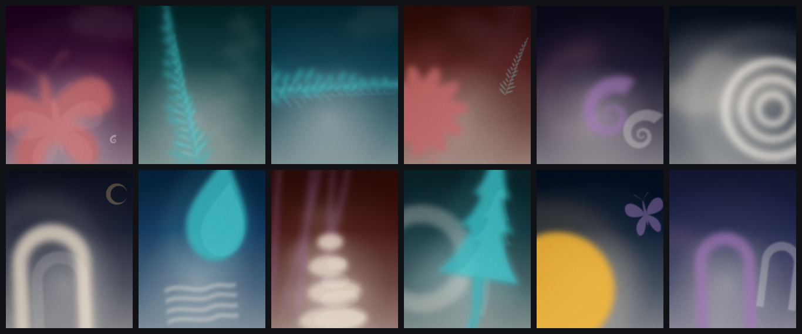

# Dream Debris Motion Studio

This is a personal, standalone social-animation and asset studio derived from
an earlier sensory-symbol study. The compositions are full-bleed and do not use
tiles or panels. The complete working tool lives in a single `index.html`; open
it directly in a Chromium browser. Generated stills and WebM exports are kept
out of the repository.

## Curated studies

The studio opens as a twelve-study, text-free visual collection. Every 4:5 page
has a different composition while sharing the source system's blur, bloom,
grain, silhouettes, and a curated nocturnal palette:

1. Night flight — a cropped moth emerging from plum
2. Botanica — a fern rising through deep green
3. Tide — a feathered fern current moving through blue
4. Wildflower — a cropped daisy and fern fragment
5. Afterimage — misregistered nautilus traces crossing plum
6. Veil — cloud and rings disappearing into night
7. Threshold — a monumental arch beneath a moon
8. Rain — a droplet passing through a wave
9. Ground — cairn and grass held close to earth
10. Evergreen — a pine moving through a ring of light
11. Orbit — orb and butterfly crossing paths
12. Passage — layered arches receding into blue

Each page is a seamless loop and can be exported as a still PNG or its own WebM.
Use **Export all 12 studies** to download the complete curated still collection.
Use **Shuffle study** to deal a different composition, a compatible alternate
symbol combination, a new curated colorway, and a new moment in its loop.
Use **Recolor** to keep the current study and symbol combination while changing
only its color story. Every study has three shape combinations and six
colorways, for 216 tested treatments across the collection.

## Edited shape vault

The shape vault includes 19 selected silhouettes. The pictured `Swallowtail`
and `Swell` silhouettes were cut from the active collection; their underlying
blur-and-echo treatment remains. The selected shapes are: Flower, Daisy, Fern,
Eucalyptus, Droplet, Nautilus, Butterfly, Grass, Cairn, Orb, Wave, Arch, Moon,
Aura, Ring, Pine, Moth, Ripples, and Cloud.

Every vault portrait uses a readable focal silhouette plus offset blurred echoes
at different depths. Use **Shuffle shape** to sample the edited library and a
new colorway; use **Recolor** to keep the current silhouette and change only its
palette. The selected treatment carries through PNG, WebM, and bulk export.
Use **Export all 19 shapes** to download every still.

Studies and Shapes now share the same Select, Shuffle, Recolor, Browse all,
single-export, loop-export, and bulk-export flow. Use either **See all** action
for a full-screen visual contact sheet. In the Shape gallery, **Clean
shapes** removes blur and echoes so the underlying geometry is easy to judge;
**Dream treatment** previews the finished atmospheric rendering. Clicking any
gallery card opens that shape on the main canvas. Opening `index.html#shapes`
launches directly into the gallery.

## Shape placement

Open any shape from the vault or gallery to reveal its placement controls. Drag
the shape directly on the main canvas, or fine-tune Horizontal, Vertical, Scale,
and Rotation in the sidebar. The focal form and all blur/echo layers move as one
composition. Placement is stored separately for each shape in the local browser
and is used by PNG, WebM, and bulk shape exports. **Center** resets the current
shape's X/Y position; **Reset all** restores every shape's default placement.

## Default film

- 22-second flowing loop by default
- 1080 × 1350 feed portrait by default, with Story/Reel and square options
- Aura → Fern → Nautilus → Moth → Arch
- Full-bleed dream-field reveal
- Return to the opening Aura for a seamless loop

The film is one continuous flow rather than a chain of held slides. Five
authored chapters move through a shared three-color story, with two or three
scenes overlapping while their forms travel through the composition. Every
chapter is assigned one authored motion idea—Crop, Touch, Echo, or Veil—so the
movement changes throughout the film without becoming a set of slides; the
closing field uses the same arrival and departure progress to drift each symbol
in and back out. Both internal handoffs and the final loop boundary share their
blended endpoint, so there is no cut when the film repeats. Scale, blur, glow,
and drift still share a breathing driver. Grain is deterministic and does not
boil between frames.

All secondary drift now derives from the selected duration rather than free-
running clock values. Automated seam checks compare the first and final states
of all 216 study treatments, all 114 shape/colorway treatments, all four closing modes,
and the full Film.

## Continuous-film shuffle

Switch to **Film** to reveal four composition styles and two
generative controls. Each style commits to a clear balance system rather than
placing shapes into interchangeable zones. **Editorial** is the recommended
default: an oversized edge crop is counterweighted by two forms across a strong
diagonal. **Motif** creates a centered two-symbol pairing organized around a
shared horizontal or vertical axis. The pair is chosen from a curated
set of visual relationships rather than arbitrary object combinations. Every
motif deal also assigns two new object colors and a new background color. **Echo** is the occasional accent mode: it holds one softened symbol
while four faint remnants enlarge, drift off-axis, blur, and evaporate around
it in staggered, loop-locked waves. Pale symbols automatically receive a softer
echo so their screen-blended glow does not flash. A restrained field of glowing motes gives every closing composition a sense
of dream debris suspended in the atmosphere. **Scatter** is now treated as one
dense diagonal constellation: five related shapes with a dominant anchor and a
clear movement across the frame. All modes use the film's restrained
three-color story rather than sampling the whole palette at once.
**Shuffle film** selects
a new five-shape sequence, palette, rotation set, and closing field in the chosen
style. **Shuffle composition** keeps the current sequence and palette but
rearranges that field. Switching style or shuffling jumps the playhead to 82% of
the film so the result is immediately visible. Blur, grain, and motion settings
are left untouched.

Each new film chapter and closing composition receives one simple motion idea
matched to the geometry of its hero shape:
**Crop** moves an oversized form through the frame edge, **Touch** brings forms
together and apart, **Echo** leaves offset color impressions, and **Veil**
passes translucent forms across one another. The dominant hero carries the
strong movement and any color residue; supporting forms breathe much more
quietly so the result reads as one composed image instead of several competing
animations. These ideas change only movement and composition; the established
blur and grain treatment is not changed. The current idea appears beside the composition style, without adding
another navigation control.

A shuffled five-chapter Film uses no more than one Echo chapter. Editorial,
Motif, and Scatter endings use Crop, Touch, or Veil; the stronger remnant field
appears only when Echo is selected deliberately.

The existing duration slider is labeled **Loop pace**. Collection loops stay in
a restrained 5–10 second range; Film stays between 18 and 30 seconds. The label
describes the result as Lively, Flowing, or Dreamy, and every choice remains a
seamless exported loop.

The 12 curated studies also carry their own fixed motion ideas. Their hero form
leads while counterforms remain calm, so the loops differ through edge crops,
form contact, drifting veils, and color residue—not just through different
static arrangements.

All shuffle controls use bags rather than re-sampling the full list. The current
result is excluded from the next deal; studies and vault shapes are exhausted
before their bags refill. Motif, Editorial, and Scatter select from a broad set
of curated shape relationships, while their exact positions, scale, crop,
rotation, palette, and timing are generated for every deal. The combinations
stay varied without losing art direction.

## Navigation

Choose **Collection** or **Film** in the floating top bar. Collection separates
the study and shape controls, while Film replaces them with film shuffle controls
and reveals the five-scene sequence. Open **Controls** to move between the sticky
**Compose**, **Look**, and **Export** sections. Film-only and bulk-export controls
stay hidden or disabled when they do not apply.

The interface is canvas-first rather than sidebar-first. Workspace switching
lives in a floating top bar, playback has its own transport beneath the artwork,
and Compose / Look / Export live in a closable right inspector. On small
screens, the inspector becomes a bottom sheet and starts closed so the artwork
remains primary. The system borrows the useful idea behind uncommon motion-
component libraries—controls should have distinct behaviors and hierarchy—
without adding a React or Next.js dependency to this standalone HTML tool.

## Working with the music

Use **Reference audio** to load a local copy of the chosen track and set its cue
point. The audio is used only during preview; exported WebM files are silent.

## Exports

- **PNG frame**: full-resolution still at the playhead
- **Layer PNGs**: background, far, middle, near, grain, and composite at the playhead
- **WebM**: the current page or film loop, recorded at the selected native
  1080px canvas size, 30 fps, and a high 12–24 Mbps bitrate based on frame area

The grain PNG is intended to be used with an Overlay blend mode in a compositor.

## Browser notes

Open `index.html` in Chrome or another Chromium browser. WebM recording depends
on `canvas.captureStream` and `MediaRecorder` support.
